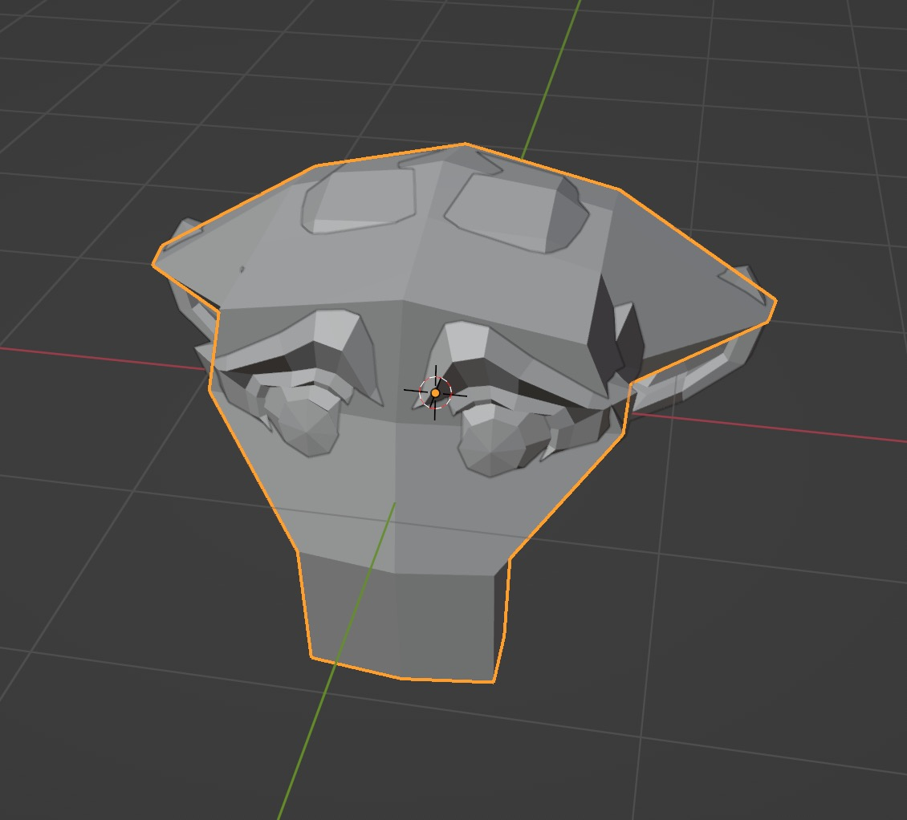
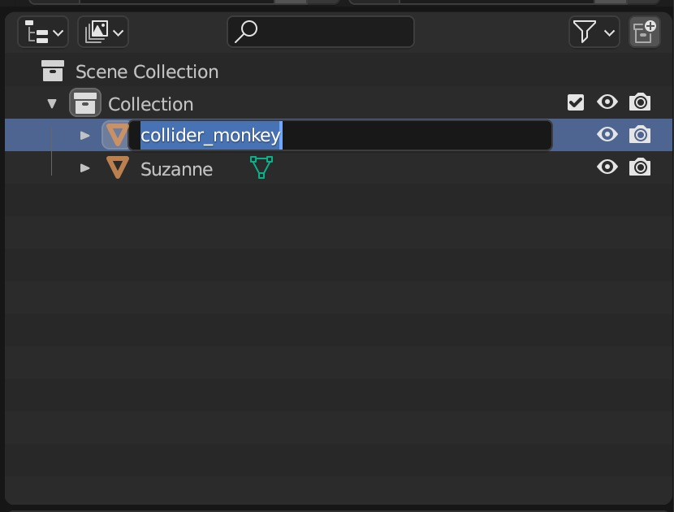
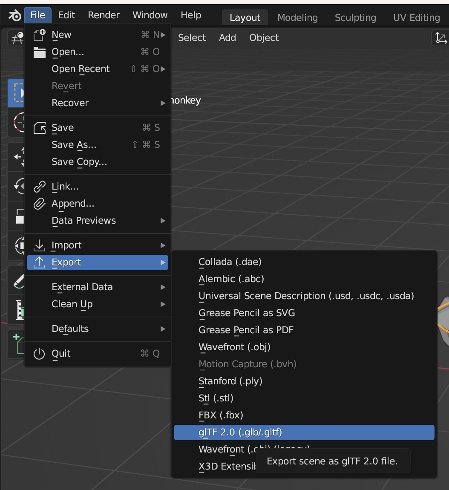
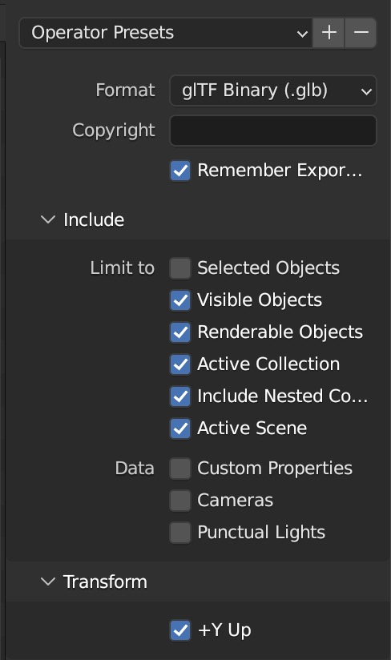
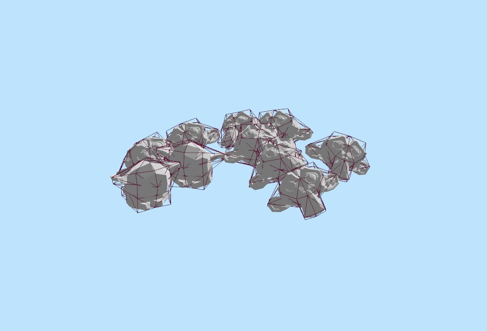

# Bevy gltf collider generator

Simple crate for [rapier3d](https://rapier.rs/) collider generation from [bevy](https://bevyengine.org/) scene loaded from gltf file.

## Usage

Check [load_object example](./examples/load_object.rs).

## How to create gltf file in blender

1. Create a mesh for collider around your object (you can add more than one)  

2. Rename all your colliders to `collider_*`  

3. Export your scene as gltf file  

4. Make sure to check this options:  

5. Load your scene in bevy and use `bevy_gltf_collider::get_scene_colliders` function to replace meshes with colliders  

